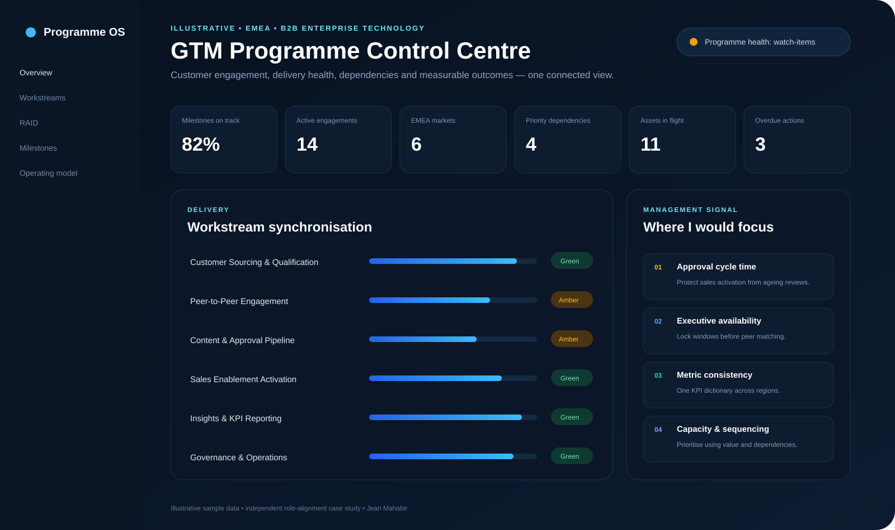
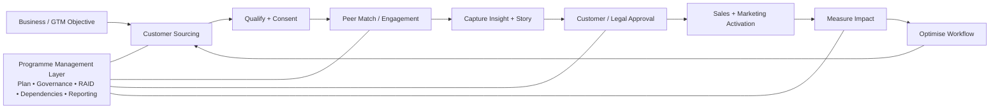

# GTM Programme Management Case Study

**Jean Mahabir - Programme & Transformation Delivery Leader**

A concise, practical demonstration of how I would structure and run a multi-workstream **EMEA go-to-market / customer-engagement programme** in a B2B enterprise-technology environment.

> **Purpose:** show the connection between my programme-management experience, technical capability and the requirements of a GTM Program Manager role - without using confidential client or company data.



## What this demonstrates

| Role need | Evidence in this repository |
|---|---|
| Multiple workstreams | Integrated workstream view, milestones and dependencies |
| Governance | RAG status, RAID, ownership, reporting cadence |
| Dashboards & KPIs | Interactive control centre driven from structured JSON |
| Customer engagement | Customer sourcing, peer engagement and approval workflow |
| GTM alignment | Sales-enablement activation and measurable business outcomes |
| Process improvement | Bottleneck identification, SLA thinking and optimisation loop |
| Technical capability | HTML/CSS/JavaScript dashboard + Python status-pack automation |
| Executive communication | Concise status narrative and decision-focused reporting |

## Programme operating model



## Workstreams

1. **Customer Sourcing & Qualification** - build the right advocate/reference pipeline.
2. **Peer-to-Peer Engagement** - coordinate credible customer-to-customer activity.
3. **Content & Approval Pipeline** - capture insight, manage reviews and reduce approval friction.
4. **Sales Enablement Activation** - turn approved evidence into usable field assets.
5. **Insights & KPI Reporting** - convert activity into visible programme performance.
6. **Governance & Operations** - integrated plan, RAID, decisions, actions and escalation.

## How I would manage it

**Plan → Align → Deliver → Track → Resolve → Measure → Improve**

- **Plan:** translate the outcome into workstreams, milestones, owners and measures.
- **Align:** establish governance, stakeholder roles, decision routes and reporting cadence.
- **Deliver:** coordinate activity across customers, marketing, operations and sales.
- **Track:** maintain a consolidated view of milestones, actions, risks, dependencies and KPIs.
- **Resolve:** surface blockers early and escalate with context, ownership and options.
- **Measure:** track engagement, adoption, cycle time and business/customer outcomes.
- **Improve:** identify repeat friction and standardise scalable ways of working.

## Interactive control centre

For the polished interactive version, enable **GitHub Pages** from the `/docs` folder after publishing this repository.

The dashboard uses illustrative sample data only. The source dataset is retained in [`data/programme_data.json`](data/programme_data.json), with a Pages-ready copy under `docs/data/`.

## Automation

Run:

```bash
python scripts/generate_status_pack.py
```

This converts the structured programme data into an executive-style status pack at [`outputs/status_report.md`](outputs/status_report.md).

## Relevant experience

My current CV shows experience across integrated planning, workstream coordination, RAID, governance, dashboards, CRM transformation, automation, stakeholder engagement and technology adoption. Selected evidence is summarised in [`case-studies.md`](case-studies.md).

## Repository map

```text
.
├── README.md
├── case-studies.md
├── role-alignment.md
├── 30-60-90-plan.md
├── assets/
│   ├── dashboard-preview.png
│   ├── operating-model.svg
│   └── alignment-map.svg
├── data/
│   ├── programme_data.json
│   └── raid_register.csv
├── docs/
│   ├── index.html
│   ├── styles.css
│   └── app.js
├── scripts/
│   └── generate_status_pack.py
└── outputs/
    └── status_report.md
```

---

**Important:** This is an independent role-alignment case study. It does not represent the target organisation, Microsoft or any client programme, and contains no confidential information.